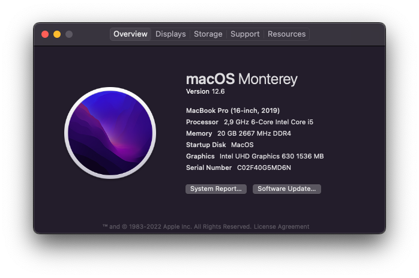

# hackintosh-config

Configuration files needed by me to run MacOS on my PC.

## [OLD] Desktop Specs

Motherboard: ASRock A320M-HD AM4 mATX DDR4  
CPU: AMD Ryzen 5 1600 AM4  
GPU: XFX RX 570 4 GB  
RAM1: HyperX Fury 8GB 2666MHz DDR4 CL16 - HX426C16FR2/8  
RAM2: Killsre 8GB 2666MHz DDR4 CL19  
SSD: Kingston A2000 250GB M.2 NVMe - SA2000M8/250G (Windows 10)  
SSD: Kingston A400 240GB SATA - SA400S37/240G (EndeavourOS Linux)  
HDD: SAMSUNG HD322HJ 320GB (MacOS)  
HDD: WDC WD10EZEX-00BN5A0 1TB (Backup/Documents)  
HDD: Hitachi HTS545050A7E380 500GB (Media/Plex)  

OpenCore version: 0.6.7  
MacOS version: macOS Big Sur 11.2.3

## [NEW] Notebook Specs

Modelo: 2AM E550  
CPU: Intel Core i5 9400  
GPU 0: Intel(R) UHD Graphics 630  
GPU 1: GTX 1050 3GB (Not used on MacOS)  
RAM1: Kllisre 16GB 2666MHz 1.2V DDR4 CL19  
RAM2: 4GB 3200MHz 1.2V DDR4  
SSD: Xraydisk 1TB (Windows 11)  
SSD: WD Blue 500GB M.2 NVME - WDS500G3B0C (MacOS)

OpenCore version: 0.8.4  
MacOS version: macOS Monterey 12.6

## Tutorial/Configuration

I followed [Dortania's Guide](https://dortania.github.io/getting-started/) to be able to run MacOS on my PC.
